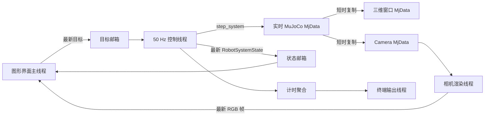

# 双通道仿真运行时设计

## 目标

在不改变控制器、MuJoCo 步进、视觉伺服、力反馈和任务状态机语义的前提下，将实时控制关键路径与图形界面、离屏渲染、终端输出和视频编码解耦。

改造分两批交付，每批形成一个独立 Git 提交：

1. 手动控制与公共运行时基础设施。
2. 自动场景的展示与录像管线。

## 不在范围内

- 不把 Python 线程宣称为硬实时控制器。
- 不修改现有控制增益、肌腱速率限制、MuJoCo 求解器或物理参数。
- 不改变 waypoint、导航、擦拭或发动机导航状态机。
- 不并行执行同一个 MuJoCo `MjData` 上的写操作。
- 不让后台线程调用 Matplotlib 图形界面接口。

## 核心约束

### 数据所有权

- 控制线程是实时 MuJoCo `MjData` 和当前控制状态的唯一写入者。
- UI 通过“最新值邮箱”提交目标；新目标覆盖尚未消费的旧目标，不积压输入队列。
- 控制线程每周期发布一个不可变状态快照；展示端只读取最新快照，可以跳过过期状态。
- 三维窗口和相机各自使用独立的 `MjData`，只在短临界区复制动态数组，`mj_forward()`、渲染和窗口同步在临界区之外执行。
- Matplotlib 控件和绘图对象只由图形界面主线程创建、修改和销毁。

### 队列策略

- 控制目标：最新值，允许覆盖旧目标。
- 面板、三维窗口、相机窗口：最新值，允许丢弃过期帧。
- 诊断历史：按显示频率采样，不要求保存每个控制周期。
- 视频编码：有界 FIFO，默认不静默丢帧；队列持续满时产生明确的过载诊断。需要最高批量速度时使用 replay 产物路径，而不是无限增长内存。

### 时钟语义

- 手动控制使用单调时钟和绝对截止时间，目标周期为 `controller_dt_s`。
- 调度器跳过已经错过的截止时间，不连续补跑过期周期。
- 等待采用可中断的粗等待加短时间高分辨率等待，避免 Windows `Event.wait()` 独自承担 20 ms 周期调度。
- 面板、三维窗口、相机和自动场景展示使用独立的基于时间的刷新门。
- 自动场景的 `realtime: true` 仍表示主动按仿真时间限速；fast batch 不启用实时等待。

## 第一批：手动控制与公共运行时基础设施

### 公共组件

新增小型运行时原语：

- `LatestValueSlot[T]`：带版本号的线程安全最新值交换。
- `MonotonicRateRunner`：绝对截止时间的可停止固定频率执行器。
- `TimeRateGate`：按时间间隔判断显示是否到期。
- `AsyncLinePrinter`：把终端 I/O 移出控制线程，并在关闭时排空。
- MuJoCo 动态状态复制函数：集中定义需要复制到独立 `MjData` 的字段。

这些组件不依赖 Matplotlib，也不导入具体任务控制器。

### 手动控制数据流

具体行为：

- `kx/ky` 滑块和数值输入框回调只操作目标锁，不再获取 MuJoCo 锁，也不直接回写控件数值。
- 命令计算从目标邮箱读取快照；MuJoCo 锁只覆盖实时数据步进或动态状态复制。
- 图形界面面板从状态邮箱读取最新完成状态，不通过 MuJoCo 锁读取 `viewer.state`。
- 被动三维窗口使用独立 `MjData`，复制后在锁外 `mj_forward()` 和 `sync()`。
- 相机线程只负责状态快照、`mj_forward()` 和渲染；图形界面定时器只呈现最新 RGB 帧。
- `RuntimeTimingReporter.finish_cycle()` 只生成待输出文本，真实 `print()` 由输出线程执行。
- 关闭顺序为：停止接收 UI 事件、停止控制线程、停止相机线程、排空计时输出、关闭窗口。

### 第一批兼容性

- 保留 `MujocoSystemDebugViewer.step()` 的单步同步接口。
- 保留适用的命令行参数和默认刷新率；后续曲率滑块改造删除不再需要的 `--curvature-step` 参数。
- `RobotSystemState`、`RobotSystemCommand` 和 backend 协议不变。
- 手动控制仍直接生成肌腱速率命令，不接入场景任务控制器。

## 第二批：自动场景展示与录像管线

### 钩子分类

现有钩子拆分为三种语义：

1. 控制关键钩子：`enrich_state()`、完成条件、安全与反馈；始终同步执行。
2. 记录钩子：状态和命令的轻量复制；保持有序，默认同步。
3. 展示输出端：三维窗口、实时面板、相机画面和视频；允许独立调度。

Observer 相机进一步拆成：

- 同步几何反馈：相机位姿、ROI 投影、深度和像素误差写回 state metadata。
- 异步画面路径：离屏渲染、overlay、窗口显示和视频编码。

因此 `visual_servo` 下一周期仍能取得对应状态的反馈，不会因显示降频而改变控制器输入。

### 交互场景运行器

当场景启用 Matplotlib 实时面板时：

- `SimulationLoop` 在仿真工作线程运行。
- 主线程运行图形界面事件循环，按时间刷新门从最新状态/命令邮箱更新各面板。
- 展示输出端关闭不会破坏仿真数据；配置为三维窗口关闭即停止时，由协调器发出明确停止请求。
- 仿真完成后，主线程执行最终一次展示更新并按顺序关闭资源。

未启用 Matplotlib 面板时仍使用现有同步 `SimulationLoop.run()`，避免为 fast batch 增加线程成本。

### 三维窗口、面板和视频

- MuJoCo 三维窗口按时间到期时同步独立数据副本，不再每个控制周期 `sync()`。
- `realtime` 睡眠与三维窗口刷新解耦，避免降低三维窗口刷新率后破坏实时倍率。
- 肌腱面板沿用持久柱状图绘图对象。
- 擦拭力面板和综合诊断面板预创建 Line2D/Text/参考线，后续使用 `set_data()`、`set_text()` 和坐标范围更新；移除周期内 `cla()/clear()/flush_events()`。
- 相机窗口只消费最新帧。
- 视频工作线程独占渲染器和写入器；仿真线程只提交带序号的状态快照。
- `run_all_scenarios --headless` 继续关闭全部窗口；实时视频的后台编码保持有界，明确报告背压。

## 错误与退出处理

- 每个工作线程捕获异常并发布第一个失败原因；控制线程异常必须令运行停止。
- 展示工作线程异常默认禁用对应输出并记录诊断，不使自动任务失去控制。
- 视频工作线程失败必须关闭写入器，并沿用现有 `video_error.txt`/产物错误信息。
- 工作线程的 `stop()` 必须幂等，禁止线程自行调用 `join()`。
- 所有线程在应用返回前停止；只允许辅助展示线程为 daemon，正常路径仍显式 join。
- 队列过载、跳过的显示帧和错过的控制截止时间进入运行计时统计。

## 测试设计

按测试先行实现，但测试执行需要用户另行明确授权。

第一批覆盖：

- 最新值覆盖和版本消费。
- rate runner 的绝对截止、错期跳过、停止和异常传播。
- UI 回调不等待 MuJoCo 锁。
- 控制步骤只短时持有 MuJoCo 锁并发布最新状态。
- 三维窗口/相机使用独立数据快照。
- 相机后台渲染只把图像帧交给图形界面，后台线程不调用 Matplotlib。
- 计时输出不在控制线程执行。

第二批覆盖：

- 控制关键钩子的顺序与原 `SimulationLoop` 一致。
- Observer 反馈每控制周期可用，显示/录像降频不改变反馈 metadata。
- Presentation sink 合并过期状态。
- 面板更新复用绘图对象且不调用 `cla()/clear()/flush_events()`。
- 视频 FIFO 顺序、backpressure、失败关闭和最终排空。
- 无界面场景不创建图形界面线程。

## 提交边界

设计文档单独提交。实现阶段形成两个提交：

1. `性能(手动控制): 隔离控制循环与渲染线程`
2. `性能(运行时): 解耦场景展示与视频管线`

第一批提交不得包含自动任务钩子行为变化；第二批提交不得修改控制算法、物理参数或任务状态机。
